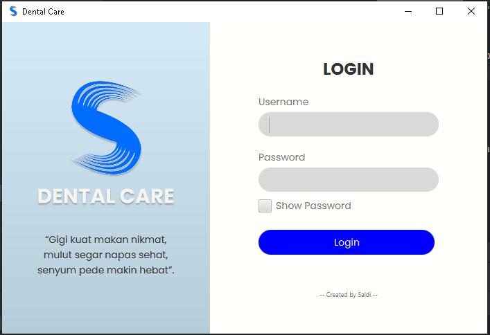
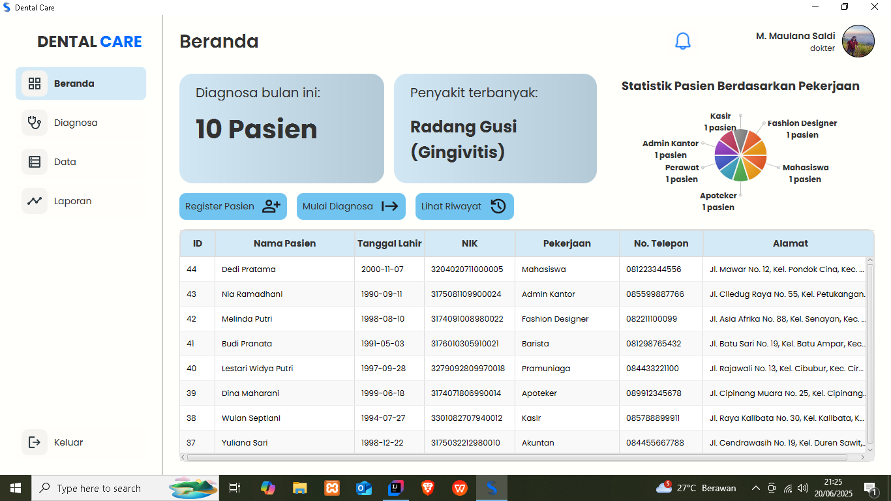
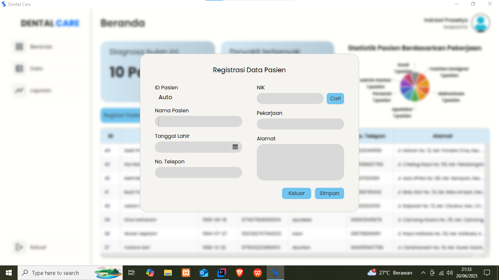
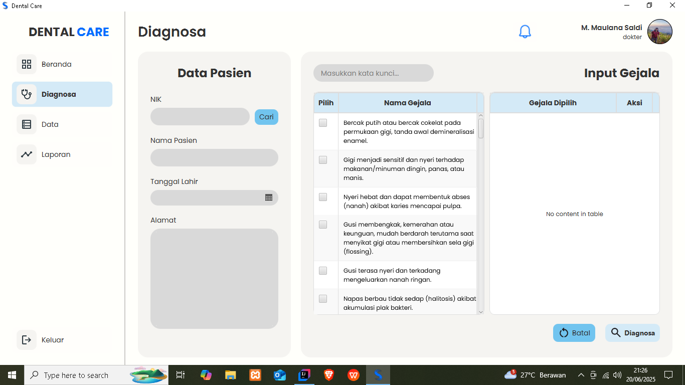
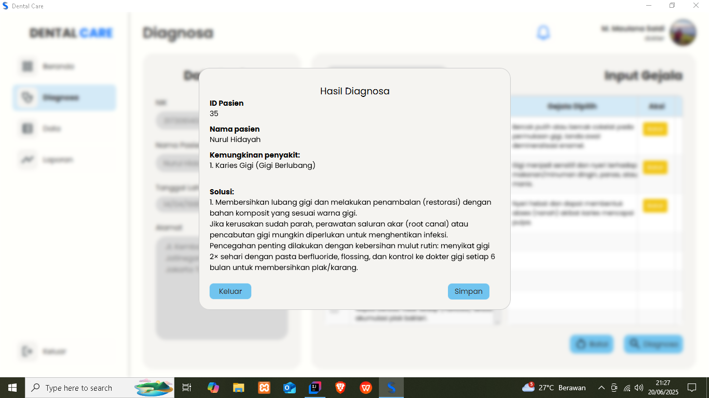
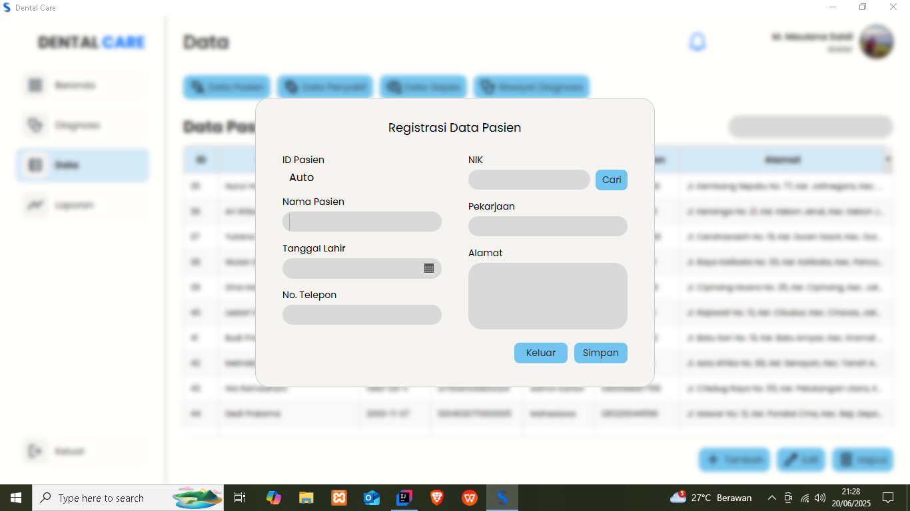
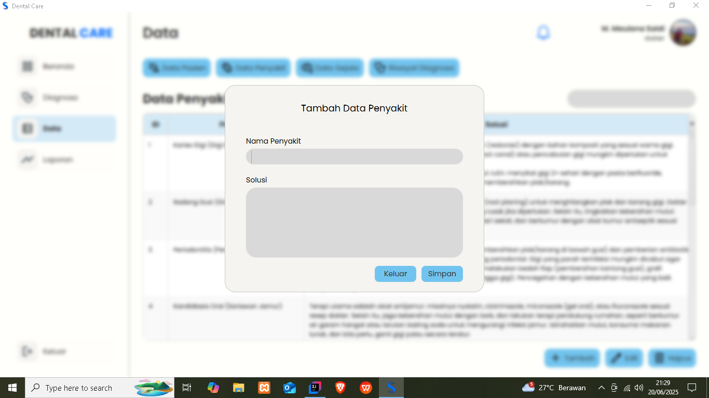
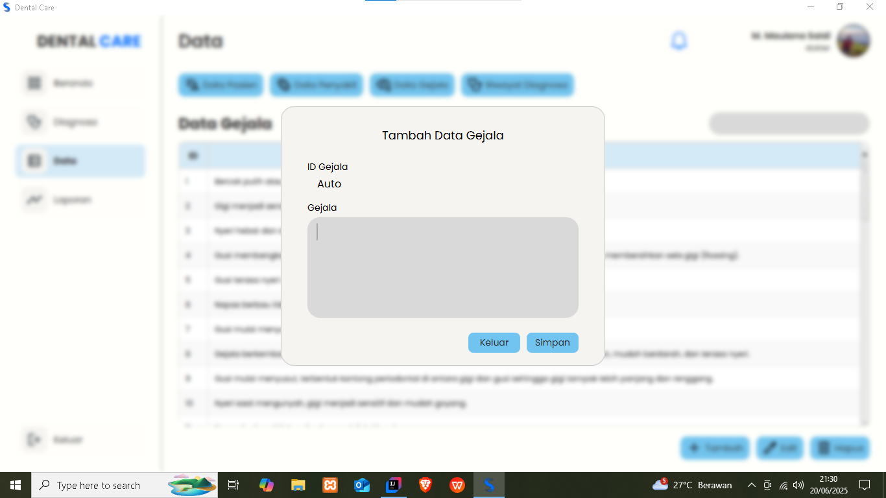
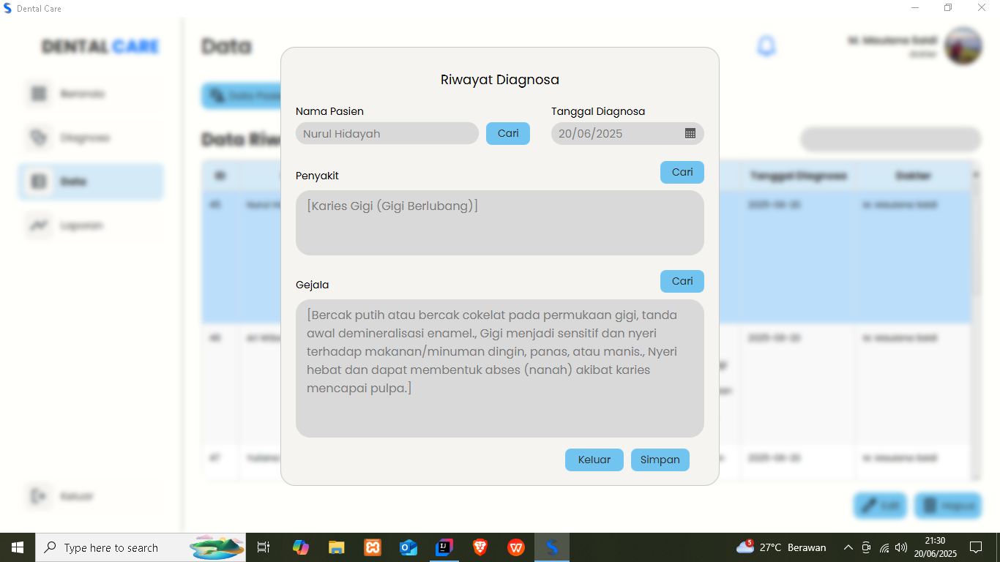

# 🦷 Expert System for Dental Disease Diagnosis
This system is a desktop-based application designed to assist in diagnosing dental and oral diseases based on symptoms experienced by patients. The application uses the Forward Chaining method to determine possible diseases based on the selected symptoms.

## 📋 Main Features
### New Patient Registration
Input data for new patients who wish to have a dental check-up.

### New Patient Notification
Displays new patient data on the doctor's dashboard when the receptionist successfully registers a new patient.

### Diagnosis Process
An expert system using the forward chaining method to diagnose diseases based on the symptoms input by the doctor.

### Data Management (CRUD)
Manage patient data, diseases, symptoms, and diagnosis history.

### Reporting
Generate reports, including patient reports, disease reports, symptom reports, and diagnosis history.

## ⚙️ Technologies Used
1. JavaFX: Graphical User Interface (GUI).
2. MySQL: Database management system.
3. Lombok: Simplifies model class coding.
4. JasperReports: For generating printable diagnosis reports.

## 🏗️ Project Structure
```text
src
├── main
│   └── java
│       └── com.example.appsaldi
│           ├── connectiondb
│           ├── controller
│           ├── dao
│           ├── model
│           └── utils
├── resources
│   └── com.example.appsaldi
│       ├── css
│       ├── img
│       ├── report
│       └── view
└── README.md
```

## 🚀 How to Run
1. Clone this repository:
**git clone https://github.com/maulanasaldi/DentalApp.git**
Import the project into your IDE (recommended: IntelliJ IDEA).
3. Ensure MySQL is running and the database is properly configured.
4. Run the project.

## 📌 Notes
* Make sure the JavaFX library and database connection are properly set up.
* You can customize ICD data, symptoms, and diseases as needed.

## 💻 Screenshots
### 1. Login Interface


### 2. Dashboard Interface
The data below is fake data


### 3. Patient Registration Interface


### 4. Diagnostic Interface


### 5. Diagnostic Results Interface


### 6. Data Interface (Doctor Access)
The data below is fake data
.png)

### 7. Patient Form Interface


### 8. Disease Form Interface


### 9. Symptom Form Interface


### 10. Diagnosis History Form Interface


### 11. Patient Report Interface (Doctor Access)
The data below is fake data
.png)

### 12. Patient Data Interface (Receptionist Access)
The data below is fake data
.png)

### 13. Patient Report Interface (Receptionist Access)
The data below is fake data
.png)

## 🙋‍♂️ Contribution
Contributions are very welcome!
Feel free to fork this repository, create a new branch, and submit a pull request.

## 📞 Contact
If you have any questions, please contact:

* Name: Maulana Saldi
* Email: maulanasaldi22@gmail.com

